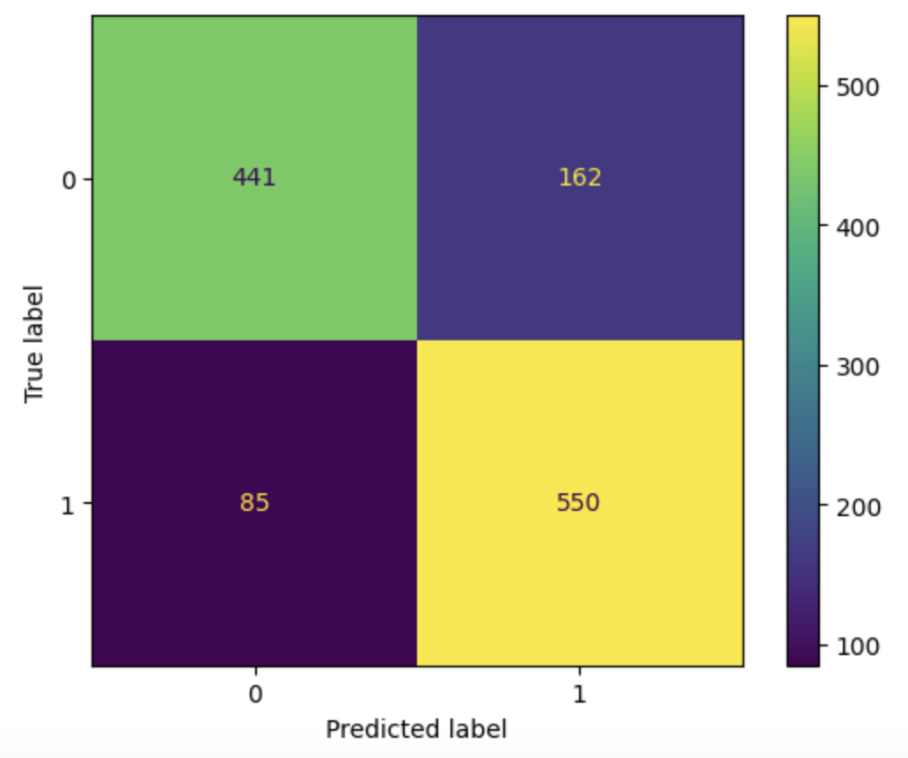
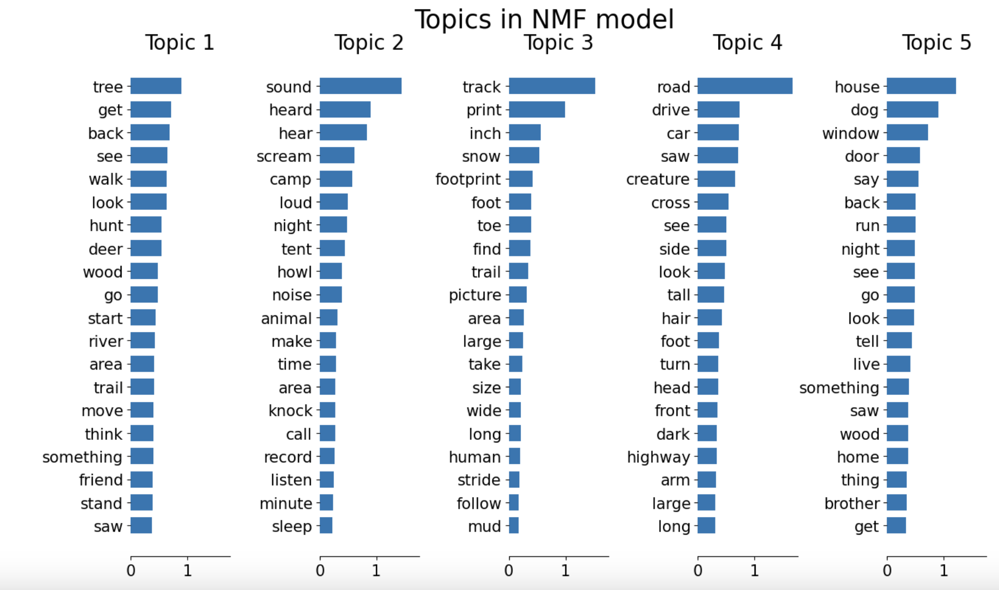
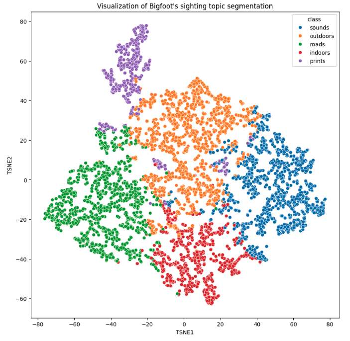

## Overview
To conduct a text classification using natural language processing (NLP)

## Business Proposition
Mr. David Attenborough is interested in featuring Bigfoot in his upcoming nature documentary. His camera crew would like to confidently know where to set up the cameras to capture a glimpse of this elusive creature. 

## Data Sources
- BigFoot Field Researchers Organization
- 4,983 reports in the U.S.A., dating back to as early as the 1870’s 

Here are the sightings of Bigfoot by state. 
Note: Alaska isn't shown here but there are 20 reports of the sightings. 

## Data Preparation
From the provided data, the classification column is split among three classes:  A, B, or C. However, I removed the class C rows because it only contained 30 reports. Too small to gather meaningful insights. Class A is defined as clear sightings in circumstances where misinterpretation or misidentification of other animals can be ruled out with greater confidence. Class B are circumstances where a possible Sasquatch was observed but did not have a clear view of the subject. Any characteristic sounds are always considered in this class.

## Text Preprocessing
To utilize the text, I used a function that preprocessed the texts in the ‘OBSERVED’ column. This involved using the TextBlob library to correct misspelled words, followed by converting them to lowercase. Next, I tokenized the words, filtering out non-alphabetic words and those in the stop words list provided in the NLTK library. Additionally, I used a function to categorize the part of speech (POS) of words to provide context and differentiate between multiple meanings. Lastly, I lemmatized the words that had a POS. 

For the model to read the text, it was necessary to convert them to vectors. This was achieved by using CountVectorizer and TfidfVectorizer from the Sklearn library. 

## Modeling
Performed multiple model types such as Multinomial Naive Bayes, Logistic Regression, and numerous tree-based models such as the Decision Tree Classifier, Random Forest Classifier, and Extra Trees Classifier. 

After tuning the parameters for all my models using GridSearchCV, Logistic Regression demonstrated the best performance, achieving an accuracy score of 80%.

 

In addition, I performed Non-Negative Matrix Factorization (NMF) topic modeling to identify the prevalent topics in the corpus. Using a t-distributed stochastic neighbor embedding (t-SNE) to visualize the clusterings of the topics. 
 

  
  

Where,  
Topic 1: Outdoors  
Topic 2: Sounds  
Topic 3: Prints  
Topic 4: Roads  
Topic 5: Indoors

The words such as road and drive in topic 4 are weighted more than the other topics. 
 

## Conclusion
With the highest probability of Class A given a sighting, I would recommend Mr. Attenborough’s film crew to set up cameras near roads in:  
Arkansas: 68.3%  
Alabama: 63.7%  
Oklahoma: 61.4%  
Kentucky: 60.1%  
Pennsylvania: 59.2%

## For More Information
See the full analysis in the Jupyter Notebook or review this presentation. For additional info, contact Julie Leung.
